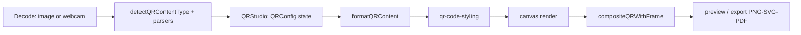

# QR Studio

Create a QR code that suits your needs, complete with a call-to-action (CTA) frame, a custom logo, and vector export — entirely client-side.

## Table of Contents

- [Features](#features)
- [Tech Stack](#tech-stack)
- [Quick Start](#quick-start)
- [Environment Variables](#environment-variables)
- [Project Structure](#project-structure)
- [Architecture & Data Flow](#architecture--data-flow)
- [Theming](#theming)
- [SEO & Sitemap](#seo--sitemap)
- [Adding a New Tool Module](#adding-a-new-tool-module)
- [Available Scripts](#available-scripts)
- [Limitations](#limitations)
- [Deployment](#deployment)
- [Changelog](#changelog)
- [License](#license)

## Features

| Area | Details |
| ---- | ------- |
| **Content types** | 10 types: URL, Wi-Fi, vCard (Contact), WhatsApp, Text, Email, Phone, SMS, Crypto, Event (VEVENT/ICS) |
| **Styling & colors** | Dot type, corner square/dot, solid + linear/radial gradients, color presets, error correction (L/M/Q/H) |
| **Logo & image** | Logo upload, preset logos, size/margin/background controls, background remover |
| **Frame & CTA** | Scan-me bottom, top banner, polaroid, phone, neon badge, ticket + custom CTA text |
| **Live preview** | 420px retina render + canvas frame compositing, ECC badge |
| **Decode / scan** | Image upload or webcam → type detection → `Load in Editor` fills the form + preview automatically |
| **Export** | High-resolution PNG (with frame), pure vector SVG, PDF; quick copy image to clipboard |

## Tech Stack

| Layer | Choice |
| ----- | ------ |
| Framework | [Astro 7](https://astro.build) (static output) |
| UI | [React 19](https://react.dev) islands (`client:load`) |
| Styling | [Tailwind CSS 4](https://tailwindcss.com) via `@tailwindcss/vite`, tokens in `@theme` |
| Language | TypeScript (strict) |
| QR engine | [`qr-code-styling`](https://github.com/kozakdenys/qr-code-styling) |
| Decoding | [`jsQR`](https://github.com/cozmo/jsQR) (image upload + webcam) |
| PDF export | [`jspdf`](https://github.com/parallax/jsPDF) |
| Icons | [Iconify](https://iconify.design) only |
| SEO | [`@astrojs/sitemap`](https://docs.astro.build/en/guides/integrations-guide/sitemap/) |

> No backend, database, or auth. Everything runs in the browser.

## Quick Start

**Prerequisite:** Node.js **22.12 or newer** (matches `engines.node` in `package.json`; required by Astro 7 and `@astrojs/react` 6).

```bash
npm install
npm run dev       # http://localhost:4321
npm run build     # static output to dist/
npm run preview   # preview the build
npx tsc --noEmit  # typecheck (strict)
```

> **Camera note:** the webcam feature needs browser camera permission and a secure context (`https://` or `http://localhost`). On mobile, open via HTTPS so the camera can be accessed.

## Environment Variables

None required for the current MVP.

| Variable | Required | Default | Description |
| -------- | :------: | ------- | ----------- |
| — | — | — | No API/DB/auth integration requiring secrets yet |

A REST API structure (API keys, quotas, rate limits) is planned — not implemented yet to avoid over-engineering the MVP.

## Project Structure

```text
src/
├── components/
│   ├── layout/
│   │   ├── AmbientGlow.astro       # decorative background glow
│   │   └── Header.tsx              # top nav: brand logo + theme toggle
│   ├── qr/
│   │   ├── QRStudio.tsx            # studio state orchestration + tabs + modals
│   │   ├── QRContentForm.tsx       # 10-type content grid + dynamic panel
│   │   ├── forms/                  # URLForm, WiFiForm, VCardForm, TextEmailForms, SpecializedForms
│   │   ├── QRStyleCustomizer.tsx   # style + color/pattern pickers
│   │   ├── QRLogoManager.tsx       # upload + preset logos + bg remover
│   │   ├── QRFrameSelector.tsx     # CTA frames
│   │   ├── QRPreviewCanvas.tsx     # live preview + export/copy buttons
│   │   ├── QRExportDialog.tsx      # PNG/SVG/PDF dialog
│   │   ├── QRDecoderModal.tsx      # decode modal (upload + webcam)
│   │   ├── logo/PresetLogoGrid.tsx # preset logo picker
│   │   └── style/                  # PatternSelector, ColorPresetPicker, ColorDetailPicker
│   └── ui/ColorInput.tsx           # reusable color input primitive
├── lib/
│   ├── types.ts        # QRConfig, QRContentType, DecodedQRResult, ...
│   ├── presets.ts      # DEFAULT_QR_CONFIG, COLOR_PRESETS, LOGO_PRESETS
│   ├── qr-formatter.ts # QRConfig → string payload (WIFI:, VCARD, mailto:, ...)
│   ├── qr-engine.ts    # createQRCodeInstance, exportPNG, exportSVG
│   ├── qr-frames.ts    # compositeQRWithFrame (canvas + CTA)
│   ├── qr-decoder.ts   # detectQRContentType, decodeQRFromImage, scanVideoFrame
│   ├── bg-remover.ts   # logo background removal
│   └── pdf-exporter.ts # PDF export
├── layouts/Layout.astro   # <head>, fonts, zero-flicker theme + favicon script
├── pages/index.astro      # single page: Header + QRStudio + footer
└── styles/global.css      # design tokens (light/dark), @theme mapping, neu-* utilities

public/
├── favicon.svg         # dark-mode favicon
├── favicon-light.svg   # light-mode favicon
├── logo.svg            # legacy brand mark (currently unreferenced)
└── robots.txt          # crawler rules + sitemap pointer
```

## Architecture & Data Flow

`QRStudio` owns the single `QRConfig` state. Edits flow one way into rendering, and decoded results are parsed back into the same config.



- **Encode:** `QRConfig` → `formatQRContent()` → `qr-code-styling` → canvas → `compositeQRWithFrame()` → preview/export.
- **Decode:** image/webcam → `decodeQRFromImage()` / `scanVideoFrame()` → `detectQRContentType()` → per-type parsers in `handleApplyDecodedText` → back into `QRConfig`.

## Theming

- **Tokens** live in `src/styles/global.css`: CSS variables on `:root` (light) and `.dark` (dark).
- **Tailwind mapping** happens in the `@theme` block of the same file (`--color-background`, `--color-primary`, `--color-blue-accent`, `--color-yellow-accent`, `--radius-major/card/control`, `--shadow-neu-*`, `--animate-fade-in`). Tokens reference the raw variables via `var()`, so `.dark` overrides still apply.
- **Dark mode** is class-based: `@custom-variant dark (&:where(.dark, .dark *))`. An inline script in `Layout.astro` applies `.dark` before first paint (zero flicker), reading `localStorage.qr_studio_theme` and falling back to the system preference.
- **Favicon** switches between `/favicon-light.svg` and `/favicon.svg` from the same theme state, updated both on load and on the header toggle.
- **Neumorphic helpers** (`.neu-card`, `.neu-elevated`, `.neu-button`, `.neu-input`) live in `@layer components`; Radii: major `24px`, card `16px`, control `12px`.

## SEO & Sitemap

- `astro.config.mjs` sets `site` to a **placeholder** `https://example.com` — replace it with the real production domain before deploying.
- `@astrojs/sitemap` runs on every build and emits `dist/sitemap-index.xml` + `dist/sitemap-0.xml`.
- `public/robots.txt` allows crawling and points to `https://example.com/sitemap-index.xml` — update the domain there too.

```bash
npm run build
# dist/sitemap-index.xml
# dist/sitemap-0.xml
# dist/robots.txt
```

## Adding a New Tool Module

Follow the QR feature-package pattern so new tools can be added without rebuilding the whole app:

1. Create a `src/components/<tool>/` folder + logic in `src/lib/<tool>-*.ts`, with types in `src/lib/types.ts` (or `src/lib/<tool>-types.ts` when large).
2. Reuse primitives in `src/components/ui/` and tokens in `global.css` — don't hardcode colors; use the `neu-card`, `neu-button`, `neu-input`, `rounded-major/card/control` classes.
3. Use Iconify icons only (commercial-friendly sets without attribution, consistent rounded-outline style and sizing). Every icon-only control must have an `aria-label` + `title`.
4. Register the tool in the navigation grid/tabs (example: `TABS` in `QRStudio.tsx`) with loading/empty/error/success states for every async action.
5. Keep dependencies minimal; justify any heavy dependency you add.
6. Update the README (features + structure) and make sure `npx tsc --noEmit` + `npm run build` stay green.

## Available Scripts

| Command | Description |
| ------- | ----------- |
| `npm run dev` | Astro dev server on `http://localhost:4321` |
| `npm run build` | Production static build to `dist/` (includes sitemap) |
| `npm run preview` | Preview the build output |
| `npm run preview:host` | Preview the production build from `dist/` with `--host` |

> `npm start` was removed on purpose: a `start` script in `package.json` makes Railpack run a server instead of serving the static build. Use `npm run preview:host` for a LAN-accessible preview.

## Limitations

- `jsQR` needs sharp images; blur, extreme angles, or low contrast may fail detection.
- SVG export is the pure QR (without the composite CTA frame — frames are drawn on canvas/PNG/PDF).
- No backend/REST API, DB, or auth yet (intentional, MVP scope).

## Deployment

The repo ships a production container path: the root [`Dockerfile`](./Dockerfile) builds the site with Node 22 and serves `dist/` through nginx using [`nginx.conf`](./nginx.conf) (port 80, `/health` endpoint for healthchecks).

- Full guide: [Dokploy build types (English)](./docs/dokploy/README.md) · [Bahasa Indonesia](./docs/dokploy/README-ID.md)
- Recommended build type: **Dockerfile**; alternative configs live in [`docs/dokploy/examples/`](./docs/dokploy/examples).
- Before going live, replace the placeholder `site` in `astro.config.mjs` and the sitemap URL in `public/robots.txt` with the real domain.

## Changelog

Release history lives in [CHANGELOG.md](./CHANGELOG.md), following [Keep a Changelog](https://keepachangelog.com/en/1.1.0/) and [Semantic Versioning](https://semver.org/spec/v2.0.0.html).

## License

MIT — see [LICENSE](./LICENSE).
